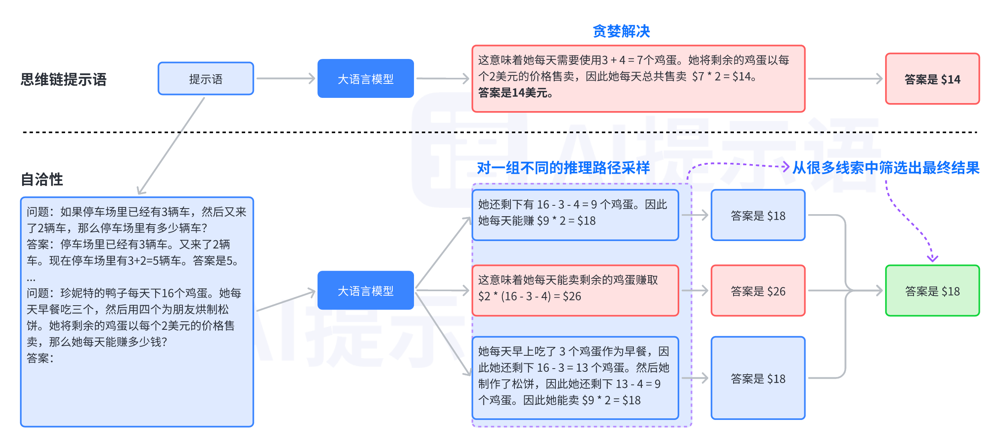

# 🌟 自洽性

自洽性（Self-Consistency）是对思维链的一个补充，它能让模型生成多个思维链，然后取最多数答案的作为最终结果。

按照 Xuezhi Wang 等人在 [2022 年发表的论文](https://arxiv.org/pdf/2203.11171.pdf) 表明。当我们只用一个逻辑链进行优化时，模型依然有可能会算错，所以 XueZhi Wang 等人提出了一种新的方法，让模型进行多次运算，然后选取最多的答案作为最终结果：

<div align="center">

<figure><figcaption></figcaption></figure>

 

<figure><figcaption><p>自洽性推理路径示例图</p></figcaption></figure>

</div>

就我们目前使用下来，OpenAI 的 GPT 模型的自洽性非常高，尤其是 GPT-4，暂时没有遇到过出现多种答案的情况。

**在此案例中，考虑如下多步推理问题：**


```
问题：如果一家商店有 10 个苹果和 8 个橙子，此时店里卖出了 6 个苹果和 4 个橙子，那么店里还剩下多少水果？

思维链提示（chain-of-thought prompting）不是直接回答问题，而是要求语言模型生成一系列模仿人类推理过程的短句：

商店有 10 个苹果。
店里有 8 个橙子。
卖了 6 个苹果。
卖了 4 个橙子。
还剩下 10 - 6 = 4 个苹果。
剩下 8 - 4 = 4 个橙子。
商店现在有 4 个苹果 + 4 个橙子 = 8 个水果。
```


使用自洽性，语言模型生成多个推理路径：


```
推理路径A：

商店有 10 个苹果。
店里有 8 个橙子。
卖了 6 个苹果。
卖了 4 个橙子。
还剩下 10 - 6 = 4 个苹果。
剩下 8 - 4 = 4 个橙子。
商店现在有 4 个苹果 + 4 个橙子 = 8 个水果。

推理路径 B：

商店最初有 10 个苹果和 8 个橙子。
商店卖了 6 个苹果，所以还剩下 10 - 6 = 4 个苹果。
商店卖了 4 个橙子，所以还剩下 8 - 4 = 4 个橙子。
商店现在有 4 个苹果 + 4 个橙子 = 8 个水果。
```


自洽性从生成的多个推理路径中选择最一致的答案。在这个例子中，推理路径 A 和 B 都得出相同的答案（8 个水果）。可以看到这种做法增加了模型对最终答案正确的信心。
