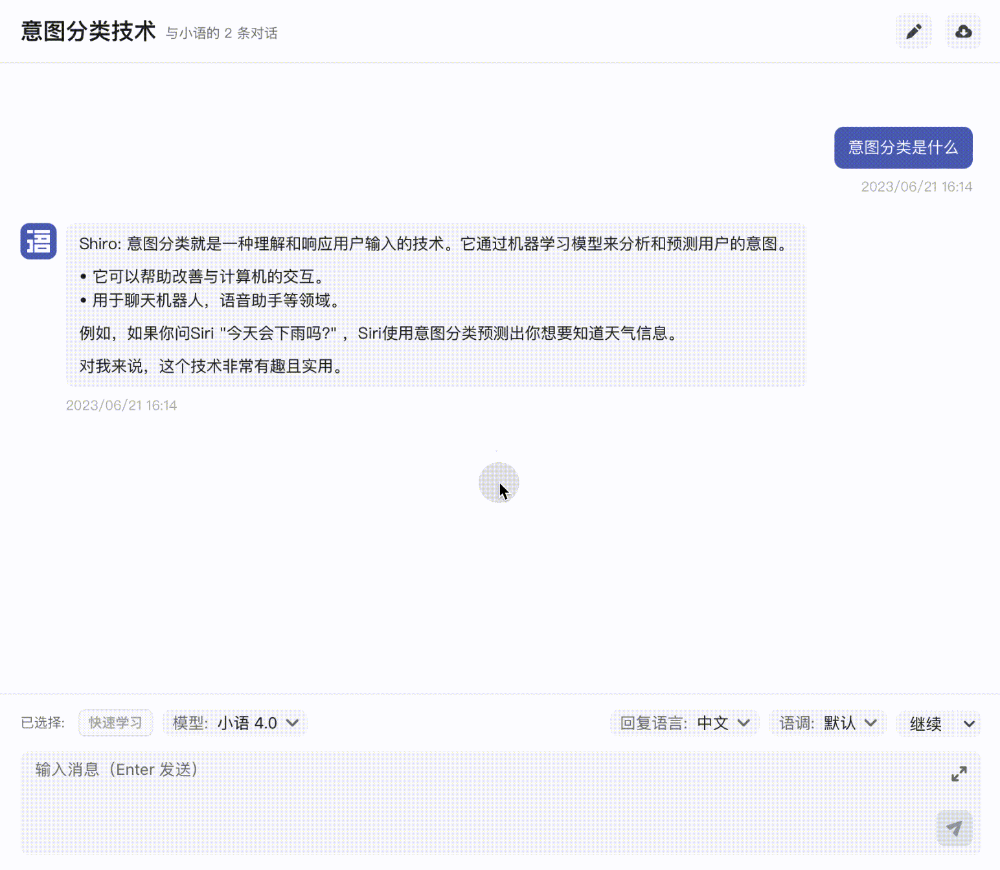
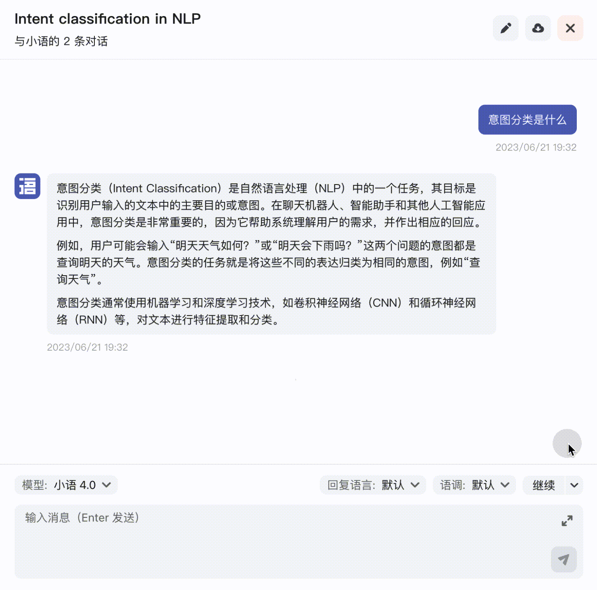

# 📘 产品技巧&常见问题

## 使用技巧&#x20;

###

### 重新生成回复的内容

小语 GPT 每次回复的内容具有一定的随机性，如果我们对小语的本次回复内容不满意，可以将鼠标悬浮到回复内容上会出现**「重试」**，点击即可重新生成回复内容。

<figure><figcaption>
以替换的方式重新生成回复内容
</figcaption></figure>

此外，如果对本次回复内容不满意，你也可以选择在输入框的上方点击**「重写」**再次生成一条回复，与前面不同的是原先的回复内容会被保留。

<figure><figcaption>
以追加的方式重新生成回复内容
</figcaption></figure>

这里相当于默认内置了一些便捷提示语，与我们在输入框中手动输入「请重写」后发送没有区别。此外，还有以下类似操作：

* 举例：若遇到难以理解的概念，可点击「举例」以帮助我们更好地理解复杂概念。
* 扩充：如果回复的内容不够充实，可点击「扩充」，将在上一条回复内容的基础上进行拓展，使回复内容更为丰富。
* 解释：同样适用于帮助我们理解复杂概念。
* 缩写：与「扩充」相反，在核心语义不变的前提下精简内容，适用于需要总结的场景。

### 修改已发送的内容需要

在对话的过程中，我们可能因为

