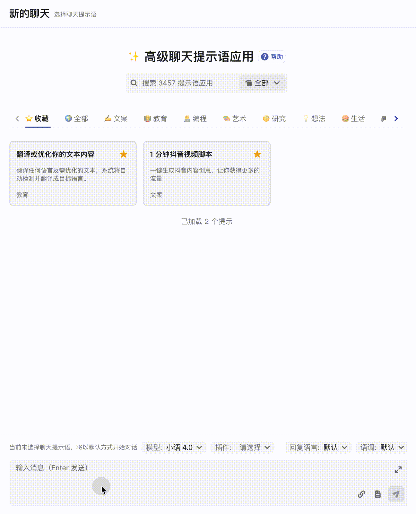
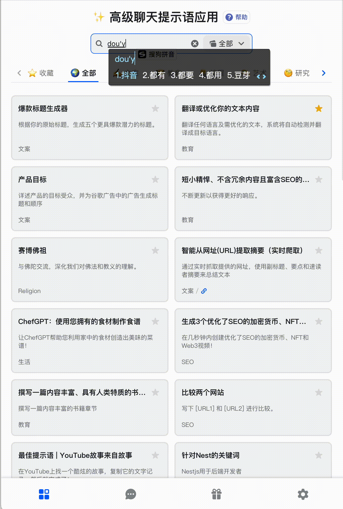
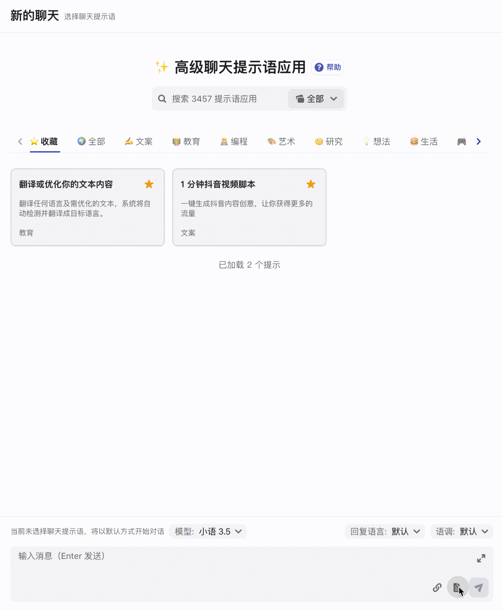
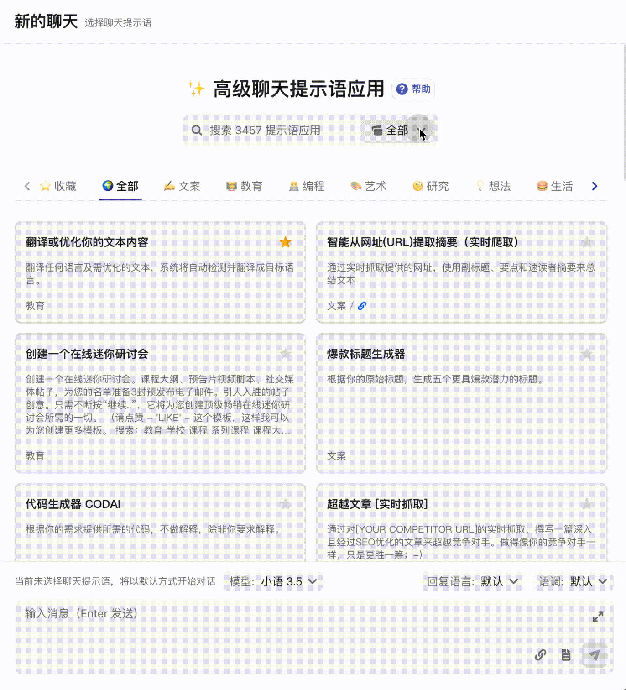
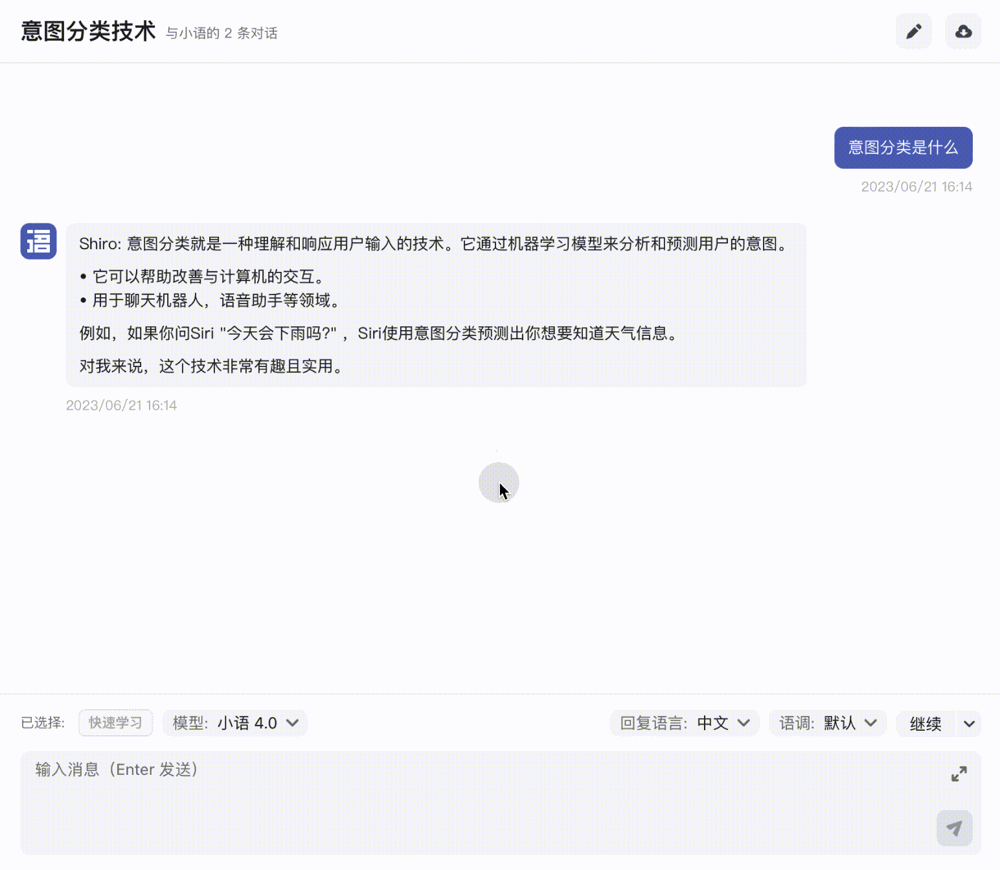
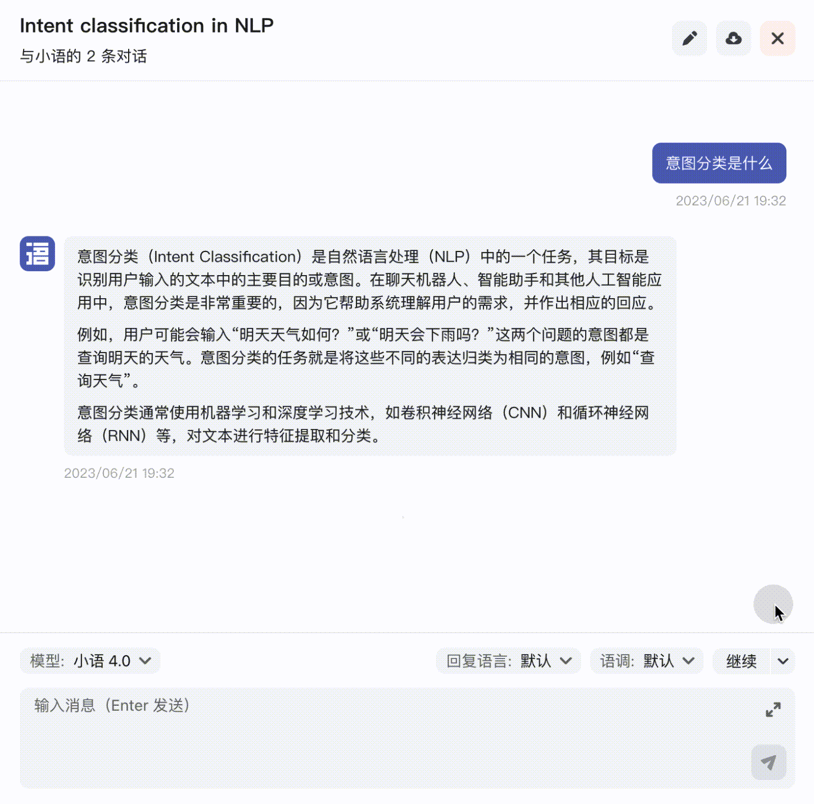
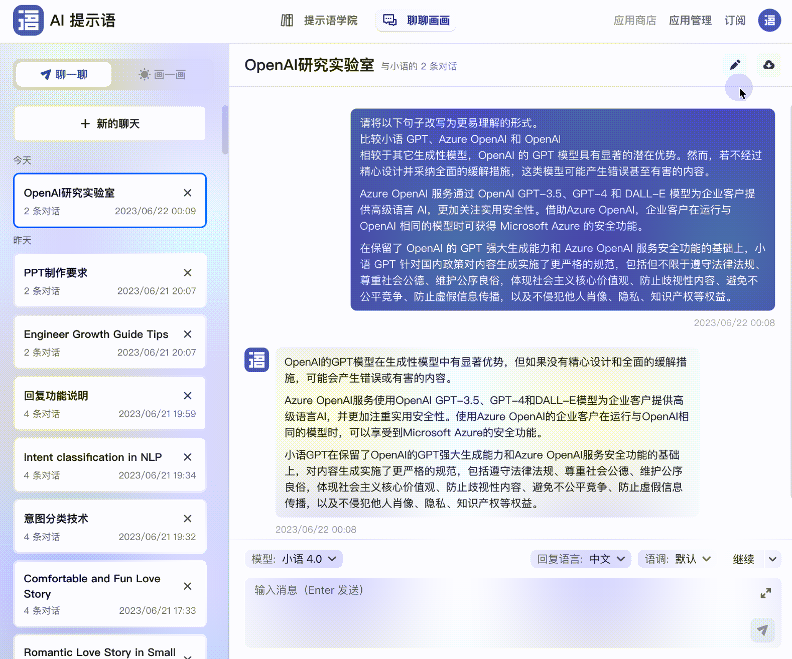

# 🎓 小语 GPT 使用


🟢 你可以在电脑端、手机 app 以及微信小程序上畅享小语的服务，使用数据完全互通。在AI提示语官网 [https://tishi.top/](https://tishi.top/) 下方可以找到入口。为了充分发挥小语 GPT 的强大功能，我们建议你在**电脑端**使用。


## 基本技巧

1. **明确地提问**：小语 GPT 能够更好地回答具有明确上下文的问题。例如，代替“它多大？”你可以问“苹果的平均重量是多少？”。
2. **使用指示性命令**：你可以使用指示性语言告诉模型应该如何回应。例如，你可以说“写一首关于春天的诗”，或者“给我列出使用番茄的五种食谱”。
3. **设定想象的角色或场景**：你可以让模型扮演特定的角色或者参与特定的场景。例如，你可以说“假设你是一位川菜大厨，告诉我这个新手如何做鱼香肉丝这道菜”。
4. **实时反馈**：如果小语 GPT 的回答不符合你的期待，你可以向其提供反馈，或者以不同的方式提出你的问题。
5. **使用多轮对话**：有时一次性提出所有的信息可能不会得到最好的回答，你可以试着通过多轮对话逐步提出问题。
6. **对新的话题创建新的聊天：**小语 GPT 的回复会受到之前聊天内容的影响，所以如果你需要问一个新话题请开启一个新的聊天。

## 直接开始对话

在对话输入框中输入你想问的任何问题（需要避免涉及敏感话题），比如「假设你是一位川菜大厨，告诉我这个新手如何做鱼香肉丝这道菜」。小语 GPT 回复后你可以继续追问，但是需要注意我们不能同时发送多条消息，必须要等 小语 GPT 回复完成后才能发送下一条消息。

<figure><figcaption>
跟小语gpt学习做鱼香肉丝
</figcaption></figure>

## 选择提示语应用开始对话

从应用市场选择一个提示语应用后，只需按照输入框中的提示信息输入，即可获得高质量的输出。

应用市场目前提供了包括文案、营销、艺术、编程、SEO、SaaS、社交媒体、电商、文化、教育、娱乐、生活、资讯、商务、宗教、公关、研究、想法等18个分类的应用，提示语应用的数量已超过 2900+ ，并且这一数字仍在不断增加。

以提示语应用 「1 分钟写抖音脚本」为例：

<figure><figcaption>
1分钟写一个抖音脚本
</figcaption></figure>

## 上传本地文档

在对话输入框点击文件 📃 图标上传本地文档和输入提示语（指令）发送即可。

<figure><figcaption>
本地文档对话
</figcaption></figure>


🟡 耗时会比较久，需耐心等待


## 抓取互联网内容

根据 URL 地址提取摘要 —— 通过实时抓取提供网址的内容，使用副标题、要点和速读者摘要来总结文本。我们以 Midjourney 官方的一篇英文教程 [https://docs.midjourney.com/docs/image-prompts](https://docs.midjourney.com/docs/image-prompts) 为例。我们输入这个地址然后等待小语帮我们翻译和总结。

<figure><figcaption>
从网址提取摘要（实时爬取）
</figcaption></figure>


🟡 耗时会比较久，需耐心等待


## 重新生成回复的内容

小语 GPT 每次回复的内容具有一定的随机性，如果我们对小语的本次回复内容不满意，可以将鼠标悬浮到回复内容上会出现**「**<mark style="color:blue;">**重试**</mark>**」**，点击即可重新生成回复内容。

<figure><figcaption>
以替换的方式重新生成回复内容
</figcaption></figure>


需要说明下，只有小语 GPT 回复的最后一条消息可以重新生成，之前的消息小语 GPT 回复的消息无法重新生成。


此外，如果对本次回复内容不满意，你也可以选择在输入框的上方点击**「重写」**再次生成一条回复，与前面不同的是原先的回复内容会被保留。

<figure><figcaption>
以追加的方式重新生成回复内容
</figcaption></figure>

这里相当于默认内置了一些便捷提示语，与我们在输入框中手动输入「请重写」后发送没有区别。此外，还有以下类似操作：

*
* 举例：若遇到难以理解的概念，可点击「举例」以帮助我们更好地理解复杂概念。
* 扩充：如果回复的内容不够充实，可点击「扩充」，将在上一条回复内容的基础上进行拓展，使回复内容更为丰富。
* 解释：同样适用于帮助我们理解复杂概念。
* 缩写：与「扩充」相反，在核心语义不变的前提下精简内容，适用于需要总结的场景。

## 修改已发送的内容

在对话的过程中，我们可能因为一些情况导致了错误的输入，我们需要修改已的内容。尤其是已经有了很长上下的对话，修改输入错误的已发送内容非常重要。

修改最后一条我们已发送的内容小语 GPT 会重新生成最后一条回复消息。修改再之前已发送的内容会清空后续的所有对话内容并重新sheng'cheng

<figure><figcaption>
修改已发送的内容
</figcaption></figure>


需要说明下，我们每次给小语 GPT 发送新消息是包括前面的对话内容的，如果对话中出现了与预期不一致或不相关的内容，这些内容将会影响小语GPT后续的回答。所以我们需要修改可能会造成干扰的内容。


## 下载对话记录内容

如果我们想把对话内容保存到本地，可以点击下载按钮保存，文档保存格式为 Markdown。如果你需要编辑可以选择本地打开或者使用[飞书文档](https://www.feishu.cn/product/docs)。

<figure><figcaption></figcaption></figure>

